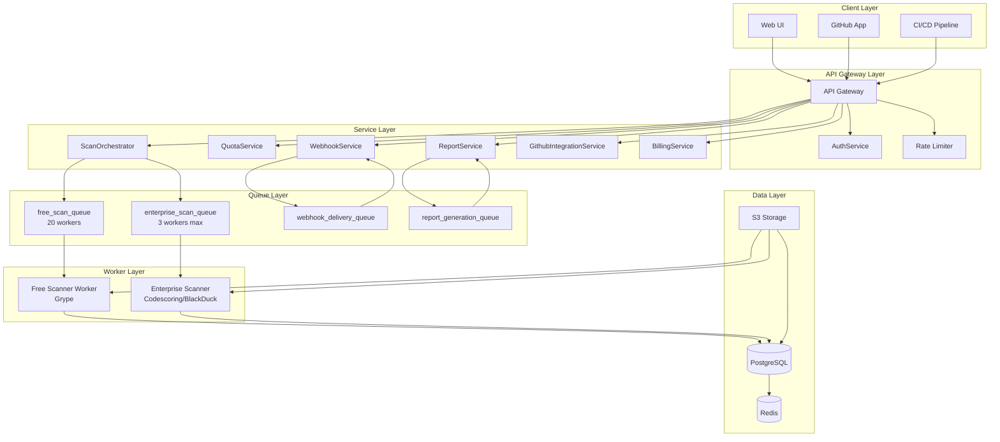
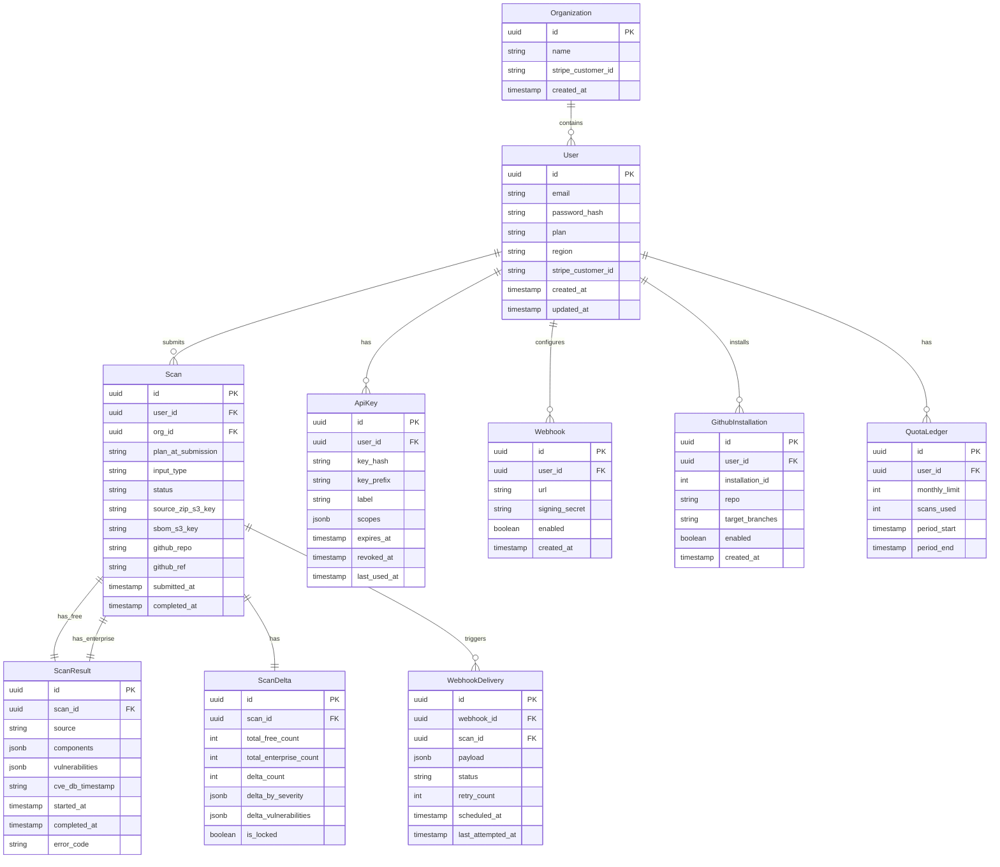
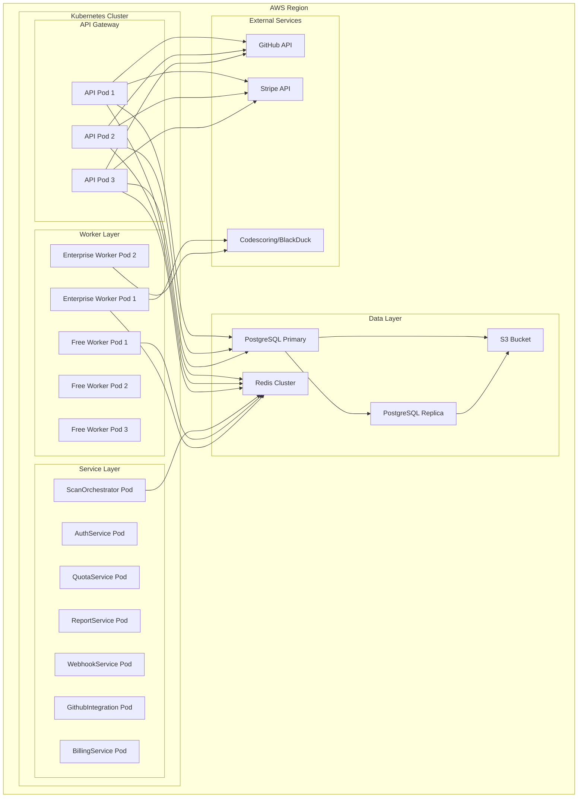

# VibeScan Design Document

## Overview

VibeScan is a SaaS vulnerability scanning platform that provides dual-scanner architecture (Grype free + Codescoring/BlackDuck enterprise) with delta comparison, tiered pricing, GitHub integration, webhook notifications, and API keys for CI/CD integration.

### Key Capabilities

- Dual-scanner architecture running Grype and Codescoring/BlackDuck in parallel
- Delta comparison showing vulnerabilities found only by enterprise scanner
- Tiered pricing: free_trial, starter, pro, enterprise
- GitHub App integration for automatic scanning on push/PR events
- Webhook notifications with HMAC-SHA256 signing
- API keys for CI/CD integration with bcrypt-hashed storage
- Source code isolation: code never leaves isolated containers
- Quota management with monthly resets
- Regional pricing for India (IN) and Pakistan (PK)

## Architecture

### High-Level Architecture Diagram



### Component Interactions

1. **API Gateway**: Handles authentication, rate limiting, and request routing
2. **AuthService**: Manages user registration, login, API keys, and token rotation
3. **ScanOrchestrator**: Coordinates scan submission, dual-scanning pipeline, and result aggregation
4. **QuotaService**: Manages monthly scan limits and usage tracking
5. **ReportService**: Generates reports with paywall enforcement based on user plan
6. **WebhookService**: Delivers scan results via webhooks with HMAC signing
7. **GithubIntegrationService**: Handles GitHub App installation and event processing
8. **BillingService**: Manages Stripe subscriptions and regional pricing

## Data Models

### Database Schema



### Key Data Structures

```typescript
// Scan Status Enum
type ScanStatus = 'pending' | 'scanning' | 'done' | 'error' | 'cancelled';

// Input Type Enum
type InputType = 'sbom_upload' | 'source_zip' | 'github_app' | 'ci_plugin';

// Plan Tiers
type PlanTier = 'free_trial' | 'starter' | 'pro' | 'enterprise';

// Vulnerability Structure
interface Vulnerability {
  id: string;
  cve_id?: string;
  ghsa_id?: string;
  severity: 'CRITICAL' | 'HIGH' | 'MEDIUM' | 'LOW';
  cvss_score: number;
  title: string;
  description: string;
  remediation?: string;
  affected_components: string[];
  source: 'free' | 'enterprise';
}

// Scan Result Structure
interface ScanResult {
  id: string;
  scanId: string;
  source: 'free' | 'enterprise';
  components: Component[];
  vulnerabilities: Vulnerability[];
  cveDbTimestamp: string;
  startedAt: string;
  completedAt: string;
  errorCode?: string;
}

// Delta Structure
interface ScanDelta {
  id: string;
  scanId: string;
  totalFreeCount: number;
  totalEnterpriseCount: number;
  deltaCount: number;
  deltaBySeverity: {
    CRITICAL: number;
    HIGH: number;
    MEDIUM: number;
    LOW: number;
  };
  deltaVulnerabilities: Vulnerability[];
  isLocked: boolean;
}
```

## Service Layer Design

### AuthService

**Responsibilities:**
- User registration with email verification
- Login with JWT token generation
- API key generation and management
- Token rotation and invalidation
- Password reset flow

**Key Interfaces:**

```typescript
interface AuthService {
  register(email: string, password: string, region: string): Promise<User>;
  login(email: string, password: string): Promise<{ accessToken: string; refreshToken: string }>;
  refreshTokens(refreshToken: string): Promise<{ accessToken: string; refreshToken: string }>;
  logout(refreshToken: string): Promise<void>;
  generateApiKey(userId: string, label: string, scopes: string[]): Promise<{ rawKey: string; keyId: string }>;
  verifyApiKey(key: string): Promise<ApiKey>;
  revokeApiKey(keyId: string): Promise<void>;
  listApiKeys(userId: string): Promise<ApiKey[]>;
}
```

**Implementation Notes:**
- API keys are cryptographically random with "vs_" prefix
- Keys are stored as bcrypt hashes; raw keys returned only once
- JWT access tokens expire in 15 minutes; refresh tokens in 30 days
- Token rotation invalidates old refresh token on each use

### QuotaService

**Responsibilities:**
- Monthly quota management with resets
- Usage tracking and enforcement
- Quota refunds for cancelled scans

**Key Interfaces:**

```typescript
interface QuotaService {
  checkQuota(userId: string): Promise<{ allowed: boolean; remaining: number; resetAt: string }>;
  consumeQuota(scanId: string): Promise<void>;
  refundQuota(scanId: string): Promise<void>;
  resetAllQuotas(): Promise<void>;
}
```

**Implementation Notes:**
- Quota decremented on job submission, not completion
- Monthly reset at 00:00 on first day of month
- Quota ledger tracks usage per user per billing period

### ScanOrchestrator

**Responsibilities:**
- Scan submission and validation
- Dual-scanning pipeline coordination
- Result aggregation and delta calculation
- Ownership verification

**Key Interfaces:**

```typescript
interface ScanOrchestrator {
  submitScan(userId: string, inputType: InputType, input: ScanInput): Promise<Scan>;
  handleWorkerResult(scanId: string, source: 'free' | 'enterprise', result: ScanResult): Promise<void>;
  cancelScan(scanId: string, userId: string): Promise<void>;
  getScan(scanId: string, userId: string): Promise<Scan>;
  listScans(userId: string, filters: ScanFilters): Promise<Scan[]>;
}
```

**Scan Input Types:**

```typescript
type ScanInput = 
  | { type: 'sbom_upload'; sbomS3Key: string }
  | { type: 'source_zip'; file: File }
  | { type: 'github_app'; installationId: number; repo: string; ref: string }
  | { type: 'ci_plugin'; sbom: CycloneDx };
```

**Implementation Notes:**
- Source code extracted to isolated Docker containers
- GitHub clones use --depth=1 for single commit
- Code destroyed immediately after SBOM generation
- Plan snapshot captured at submission time

### ReportService

**Responsibilities:**
- Report generation with paywall enforcement
- Delta vulnerability calculation
- PDF generation
- CI decision making

**Key Interfaces:**

```typescript
interface ReportService {
  getReport(scanId: string, userId: string, format: 'json' | 'summary' | 'pdf' | 'ci'): Promise<Report>;
  generatePdf(scanId: string, userId: string): Promise<{ jobId: string }>;
  getCiDecision(scanId: string, userId: string, thresholdSeverity: Severity): Promise<CiDecision>;
}
```

**Paywall Enforcement:**
- Starter plan: locked view with delta counts only
- Pro/Enterprise: full view with all delta vulnerabilities
- Webhook payloads exclude delta details for starter plan

### WebhookService

**Responsibilities:**
- Webhook delivery with HMAC signing
- Exponential backoff retry strategy
- Payload construction based on plan

**Key Interfaces:**

```typescript
interface WebhookService {
  deliverScanResults(scanId: string): Promise<void>;
  buildPayload(scan: Scan, scanDelta: ScanDelta, userId: string): Promise<WebhookPayload>;
  signPayload(payload: string, signingSecret: string): string;
}
```

**Retry Strategy:**
- Attempt 1: 1 minute
- Attempt 2: 5 minutes
- Attempt 3: 30 minutes
- Attempt 4: 2 hours
- Attempt 5: 24 hours
- After 5 failures: status = exhausted

### GithubIntegrationService

**Responsibilities:**
- GitHub App installation management
- Event processing (push, PR)
- Check run posting
- Installation token generation

**Key Interfaces:**

```typescript
interface GithubIntegrationService {
  handleInstallationEvent(event: GithubInstallationEvent): Promise<void>;
  handlePushEvent(event: GithubPushEvent): Promise<void>;
  handlePullRequestEvent(event: GithubPullRequestEvent): Promise<void>;
  postCheckResult(scanId: string, installationId: number, commitSha: string): Promise<void>;
  generateInstallationToken(installationId: number): Promise<string>;
}
```

### BillingService

**Responsibilities:**
- Stripe integration for subscriptions
- Regional pricing (PPP discounts for IN/PK)
- Webhook handling for subscription events
- Grace period management

**Key Interfaces:**

```typescript
interface BillingService {
  createCheckoutSession(userId: string, plan: PlanTier): Promise<string>;
  applyRegionalPricing(region: string): boolean;
  handleStripeWebhook(payload: string, signature: string): Promise<void>;
  getSubscriptionDetails(userId: string): Promise<SubscriptionDetails>;
}
```

## Worker Architecture

### Free Scanner Worker (Grype)

**Job Processing:**
1. Receive job from free_scan_queue
2. Download source code from S3
3. Extract to isolated Docker container
4. Run Syft to generate SBOM
5. Pipe SBOM to Grype via stdin
6. Parse Grype output and normalize vulnerabilities
7. Update CVE database every 6 hours

**Security:**
- Container runs with --network=none, --read-only, --user=nobody
- Source code destroyed after SBOM generation
- No network access during scanning

### Enterprise Scanner Worker (Codescoring/BlackDuck)

**Job Processing:**
1. Acquire distributed lock via Redis (max 3 concurrent)
2. Create temporary project in Codescoring
3. Upload SBOM and start async scan
4. Poll every 10 seconds for up to 10 minutes
5. Fetch vulnerabilities with pagination (200 items/page)
6. Cleanup temporary project
7. Release distributed lock

**Error Handling:**
- Timeout after 10 minutes returns bd_timeout error
- Partial results accepted (free scanner only)
- Distributed lock ensures max 3 parallel requests

### Queue Configuration

| Queue | Workers | Priority | Notes |
|-------|---------|----------|-------|
| free_scan_queue | 20 | High | Grype scanning |
| enterprise_scan_queue | 3 | Medium | Codescoring/BlackDuck |
| webhook_delivery_queue | 10 | Low | Webhook retries |
| report_generation_queue | 5 | Low | PDF generation |

## Security Design

### Authentication & Authorization

- JWT tokens with 15-minute access tokens, 30-day refresh tokens
- API keys with bcrypt-hashed storage
- Ownership verification for all scan operations
- Organization-level access control for enterprise plans

### Source Code Isolation

- Docker containers with --network=none, --read-only, --user=nobody
- GitHub clones use --depth=1 for single commit
- Source code destroyed immediately after SBOM generation
- S3 storage with 24-hour TTL for source archives

### Data Encryption

- PostgreSQL pgcrypto for sensitive fields:
  - Stripe customer IDs
  - API key hashes
  - Webhook signing secrets
- Encryption keys managed via AWS KMS or HashiCorp Vault

### API Key Security

- Cryptographically random keys with "vs_" prefix
- Keys stored as bcrypt hashes; raw keys returned only once
- Key prefixes stored for lookup; never expose raw keys
- Revoked keys immediately invalidated

## Scalability Considerations

### Horizontal Scaling

- Stateless API services scaled via Kubernetes
- Worker pools scaled independently per queue
- Redis for distributed locking and caching
- S3 for file storage with versioning

### Database Optimization

- Read replicas for report generation
- Connection pooling via PgBouncer
- Indexes on user_id, status, submitted_at
- Partitioning by month for large tables

### Caching Strategy

- Redis cache for:
  - User plan information
  - API key lookups
  - Webhook configurations
  - CVE database metadata

### Rate Limiting

- Per-user rate limits based on plan tier
- API key-specific limits
- GitHub webhook rate limit handling

## Error Handling

### Scanner Errors

- Free scanner failure: continue with enterprise result
- Enterprise scanner failure: finalize with free result only
- Both scanners fail: set status to error with error_message
- Codescoring timeout: return bd_timeout error code

### Quota Errors

- Quota exceeded: return 429 with {remaining, reset_at}
- Quota refund: decrement scans_used on cancellation

### Webhook Errors

- Exponential backoff: 1 min, 5 min, 30 min, 2 hours, 24 hours
- Exhausted after 5 attempts: notify user

## Deployment Considerations

### Infrastructure

- Kubernetes cluster for services and workers
- PostgreSQL with pgcrypto extension
- Redis for distributed locking and caching
- S3 for file storage with lifecycle policies
- AWS KMS for encryption key management

### CI/CD Pipeline

- Automated testing with property-based tests
- Security scanning of dependencies
- Container image scanning
- Infrastructure as code via Terraform

### Monitoring

- Prometheus metrics for:
  - Queue depths
  - Worker latency
  - Error rates
  - Quota usage
- Alerting on:
  - Queue backlogs
  - High error rates
  - Quota exhaustion
  - Worker failures

## Testing Strategy

### Unit Tests

- Specific examples for business logic
- Edge cases for input validation
- Integration points between services

### Property-Based Tests

- All testable acceptance criteria converted to properties
- Minimum 100 iterations per property test
- Tags: **Feature: vibescan, Property {number}**

### Test Coverage

- Authentication flow properties
- Quota management properties
- Delta calculation properties
- Webhook delivery properties
- GitHub integration properties

## Implementation Notes

### Priority Order

1. Core scanning pipeline (submission, dual-scanning, delta)
2. Authentication and API key management
3. Quota management
4. Report generation with paywall
5. Webhook delivery
6. GitHub integration
7. Billing integration
8. Advanced features (PDF, CI decision)

### Technical Stack

- Backend: Node.js/TypeScript
- Database: PostgreSQL with pgcrypto
- Cache: Redis
- Queue: BullMQ (Redis-based)
- Container: Docker for isolated scanning
- Infrastructure: Kubernetes, AWS

### Security Checklist

- [ ] All API keys bcrypt-hashed
- [ ] Source code isolated in containers
- [ ] Sensitive data encrypted at rest
- [ ] Webhook payloads HMAC-signed
- [ ] Ownership verification on all endpoints
- [ ] Rate limiting per user and API key
- [ ] Input validation on all endpoints
- [ ] Security scanning of dependencies
## Correctness Properties

*A property is a characteristic or behavior that should hold true across all valid executions of a system-essentially, a formal statement about what the system should do. Properties serve as the bridge between human-readable specifications and machine-verifiable correctness guarantees.*

### Property 1: Scan submission decrements quota atomically

*For any* user with available quota, submitting a scan should atomically decrement their quota counter and return a scan with status pending

**Validates: Requirements 3.3, 21.1**

### Property 2: Quota refund on cancellation

*For any* scan in pending or scanning status that is cancelled, the quota counter should be decremented to refund the consumed quota

**Validates: Requirements 3.4, 21.4**

### Property 3: Plan snapshot immutability

*For any* scan, the plan_at_submission field should remain unchanged regardless of user plan changes during scan execution

**Validates: Requirements 22.1, 22.2, 22.3, 22.4**

### Property 4: Delta paywall enforcement

*For any* starter plan user, the delta_vulnerabilities array should be empty or null in all report views, webhook payloads, and GitHub check runs

**Validates: Requirements 23.1, 23.2, 23.3, 23.4, 23.5**

### Property 5: Free scanner isolation

*For any* source code scan, the code should exist only within an isolated Docker container with --network=none, --read-only, and --user=nobody, and should be destroyed immediately after SBOM generation

**Validates: Requirements 16.1, 16.2, 16.3**

### Property 6: API key hash-only storage

*For any* API key, the system should store only the bcrypt hash and key_prefix, never the raw key, and should return the raw key only once at generation time

**Validates: Requirements 17.1, 17.2, 17.3, 17.4**

### Property 7: Ownership verification

*For any* scan lookup or report request, the system should verify that the requesting user_id matches scan.user_id or scan.org_id contains user, returning 404 if verification fails

**Validates: Requirements 27.1, 27.2, 27.3, 27.4, 27.5**

### Property 8: Webhook HMAC signing

*For any* webhook delivery, the X-VibeScan-Signature header should contain a valid HMAC-SHA256 signature of the payload using the webhook's signing_secret

**Validates: Requirements 13.3**

### Property 9: Exponential backoff retry

*For any* failed webhook delivery, subsequent retry attempts should follow exponential backoff: 1 min, 5 min, 30 min, 2 hours, 24 hours, then exhausted status

**Validates: Requirements 13.4, 13.5**

### Property 10: Enterprise scanner concurrency limit

*For any* enterprise scan job, the system should maintain max 3 parallel Codescoring requests via distributed lock, and should retry jobs if lock cannot be acquired within 5 minutes

**Validates: Requirements 9.2, 9.3, 9.9**

### Property 11: Source code TTL cleanup

*For any* source code archive stored in S3, the system should automatically delete it after 24 hours via TTL lifecycle policy

**Validates: Requirements 16.5**

### Property 12: Regional pricing discount

*For any* user with region IN or PK, the Stripe checkout session should include a 50% discount coupon

**Validates: Requirements 24.1, 24.2, 24.3, 24.4**

### Property 13: Input validation rejection

*For any* invalid input (ZIP > 50MB, invalid SBOM, invalid GitHub URL, invalid webhook URL), the system should return appropriate error response without processing

**Validates: Requirements 25.1, 25.2, 25.3, 25.4, 25.5**

### Property 14: Scan result aggregation

*For any* scan with both free and enterprise results, the delta calculation should merge vulnerabilities by cve_id, preferring enterprise versions, and compute correct severity breakdown

**Validates: Requirements 10.1, 10.2, 10.3, 10.4**

### Property 15: Error handling with partial results

*For any* scan where only one scanner fails, the system should finalize with the successful scanner's results and set appropriate error status

**Validates: Requirements 20.1, 20.2, 20.3**

### Property 16: CVE database freshness

*For any* free scanner result, the cve_db_timestamp should reflect the last database update (within 6 hours of scan completion)

**Validates: Requirements 8.4**

### Property 17: GitHub App authorization

*For any* GitHub scan request, the system should validate that the installation is authorized for the specified repo before proceeding

**Validates: Requirements 6.1, 6.2**

### Property 18: Report format consistency

*For any* report request, the format parameter (json, summary, pdf, ci) should return appropriately structured data without exposing delta details to starter plan users

**Validates: Requirements 11.1, 11.2, 11.3, 11.4, 12.1, 12.2, 12.3, 12.4, 12.5**

### Property 19: Quota ledger accuracy

*For any* user's quota ledger, the scans_used count should accurately reflect the number of scans submitted (not completed) during the billing period

**Validates: Requirements 21.5**

### Property 20: Webhook payload plan consistency

*For any* webhook delivery, the payload should exclude delta_vulnerabilities details when the scan was submitted under a starter plan

**Validates: Requirements 13.5**

## Property Reflection

After completing the initial prework analysis, I performed property reflection to eliminate redundancy:

**Redundancy Analysis:**

1. **Properties 1 and 21.5**: Both address quota ledger accuracy. Property 1 covers atomic decrement on submission, Property 21.5 covers the ledger accuracy requirement. These are complementary and both necessary.

2. **Properties 3 and 22.1-22.4**: Property 3 captures the core immutability requirement, while 22.1-22.4 are implementation details. Property 3 subsumes the specific requirements.

3. **Properties 4 and 23.1-23.5**: Property 4 captures the core paywall enforcement, while 23.1-23.5 are interface-specific implementations. Property 4 subsumes the specific requirements.

4. **Properties 6 and 17.1-17.4**: Property 6 captures the core hash-only storage requirement, while 17.1-17.4 are implementation details. Property 6 subsumes the specific requirements.

5. **Properties 7 and 27.1-27.5**: Property 7 captures the core ownership verification requirement, while 27.1-27.5 are endpoint-specific implementations. Property 7 subsumes the specific requirements.

6. **Properties 12 and 24.1-24.4**: Property 12 captures the core regional pricing requirement, while 24.1-24.4 are implementation details. Property 12 subsumes the specific requirements.

**Consolidated Properties:**

The following properties were identified as redundant and removed:
- 22.1, 22.2, 22.3, 22.4 (redundant with Property 3)
- 23.1, 23.2, 23.3, 23.4, 23.5 (redundant with Property 4)
- 17.1, 17.2, 17.3, 17.4 (redundant with Property 6)
- 27.1, 27.2, 27.3, 27.4, 27.5 (redundant with Property 7)
- 24.1, 24.2, 24.3, 24.4 (redundant with Property 12)

**Final Property Set:**

The remaining 20 properties provide comprehensive coverage of all testable acceptance criteria without redundancy.
## Error Handling

### Error Codes

| Code | HTTP Status | Description | Recovery |
|------|-------------|-------------|----------|
| quota_exceeded | 429 | Monthly scan limit reached | Wait for quota reset |
| invalid_input | 400 | Request validation failed | Fix input and retry |
| not_authorized | 403 | GitHub App not authorized for repo | Install app on repo |
| not_found | 404 | Resource not found or ownership verification failed | Check resource ID |
| bd_timeout | 408 | Codescoring scan timeout | Retry later |
| api_key_expired | 401 | API key expired | Generate new key |
| api_key_revoked | 401 | API key revoked | Generate new key |
| scan_cancelled | 409 | Scan already cancelled or processing | Check scan status |
| payload_too_large | 413 | Source ZIP exceeds 50MB | Compress and retry |
| invalid_sbom | 400 | SBOM validation failed | Fix SBOM format |

### Retry Strategies

**Free Scanner:**
- Immediate retry on transient failures
- Max 3 retries before marking as error

**Enterprise Scanner:**
- Distributed lock retry: 5 minutes max wait
- Scan polling: 10 second intervals, 10 minute timeout
- Max 2 retries on timeout

**Webhook Delivery:**
- Exponential backoff: 1 min, 5 min, 30 min, 2 hours, 24 hours
- Max 5 attempts before exhausted status

### Graceful Degradation

- Free scanner failure: continue with enterprise result
- Enterprise scanner failure: finalize with free result only
- Both scanners fail: set status to error with error_message
- Webhook delivery failure: retry with backoff, notify on exhaustion
- PDF generation failure: email user with error details

## Testing Strategy

### Dual Testing Approach

**Unit Tests:**
- Specific examples for business logic
- Edge cases for input validation
- Integration points between services
- Error handling scenarios

**Property-Based Tests:**
- All testable acceptance criteria converted to properties
- Minimum 100 iterations per property test
- Random generation of valid and invalid inputs
- Coverage of boundary conditions

### Property-Based Testing Configuration

**Library:** fast-check (TypeScript)

**Configuration:**
```typescript
import * as fc from 'fast-check';

fc.configureGlobal({
  numRuns: 100,  // Minimum 100 iterations per property
  maxLength: 1000,  // Max array/string length
  maxDepth: 10,  // Max object depth
  verbose: false,
});
```

**Test Tag Format:**
```typescript
// Feature: vibescan, Property 1: Scan submission decrements quota atomically
// Feature: vibescan, Property 2: Quota refund on cancellation
// Feature: vibescan, Property 3: Plan snapshot immutability
// ... (properties 4-20)
```

### Test Coverage Matrix

| Requirement | Test Type | Coverage |
|-------------|-----------|----------|
| 1. User Auth | Unit + Property | All acceptance criteria |
| 2. API Keys | Unit + Property | All acceptance criteria |
| 3. Quota | Property | All acceptance criteria |
| 4. Source ZIP | Unit + Property | All acceptance criteria |
| 5. SBOM Upload | Unit + Property | All acceptance criteria |
| 6. GitHub Integration | Unit + Property | All acceptance criteria |
| 7. Dual-Scanner | Property | All acceptance criteria |
| 8. Free Scanner | Unit + Property | All acceptance criteria |
| 9. Enterprise Scanner | Unit + Property | All acceptance criteria |
| 10. Delta Comparison | Property | All acceptance criteria |
| 11. Report Full View | Unit + Property | All acceptance criteria |
| 12. Report Locked View | Property | All acceptance criteria |
| 13. Webhook Delivery | Property | All acceptance criteria |
| 14. GitHub App | Unit + Property | All acceptance criteria |
| 15. Billing | Unit + Property | All acceptance criteria |
| 16. Source Isolation | Property | All acceptance criteria |
| 17. API Key Storage | Property | All acceptance criteria |
| 18. Data Encryption | Unit | All acceptance criteria |
| 19. Queue Architecture | Unit | All acceptance criteria |
| 20. Error Handling | Unit + Property | All acceptance criteria |
| 21. Quota Behavior | Property | All acceptance criteria |
| 22. Plan Snapshot | Property | All acceptance criteria |
| 23. Delta Paywall | Property | All acceptance criteria |
| 24. Regional Pricing | Unit + Property | All acceptance criteria |
| 25. Input Validation | Unit + Property | All acceptance criteria |
| 26. Pagination | Unit | All acceptance criteria |
| 27. Ownership | Property | All acceptance criteria |
| 28. Error Messages | Unit | All acceptance criteria |
| 29. Scan Cancellation | Property | All acceptance criteria |
| 30. Report Formats | Unit + Property | All acceptance criteria |

### Test Examples

**Property 1: Scan submission decrements quota atomically**
```typescript
// Feature: vibescan, Property 1: Scan submission decrements quota atomically
it('should atomically decrement quota on scan submission', () => {
  fc.assert(fc.property(
    fc.integer({ min: 1, max: 999 }),  // initial quota
    fc.string(),  // user_id
    fc.string(),  // scan_id
    (initialQuota, userId, scanId) => {
      // Setup: create user with initial quota
      const user = createUser({ plan: 'pro', quota: initialQuota });
      
      // Action: submit scan
      const result = submitScan(userId, scanId);
      
      // Verify: quota decremented by 1
      expect(result.allowed).toBe(true);
      expect(result.remaining).toBe(initialQuota - 1);
    }
  ));
});
```

**Property 4: Delta paywall enforcement**
```typescript
// Feature: vibescan, Property 4: Delta paywall enforcement
it('should enforce delta paywall for starter plan', () => {
  fc.assert(fc.property(
    fc.string(),  // scan_id
    fc.constant('starter'),  // plan
    fc.array(vulnerabilityArb),  // enterprise vulnerabilities
    (scanId, plan, enterpriseVulns) => {
      // Setup: create scan with starter plan and enterprise vulns
      const scan = createScan({ plan, enterpriseVulns });
      
      // Action: get report
      const report = getReport(scanId, plan);
      
      // Verify: delta_vulnerabilities is empty/null
      expect(report.deltaVulnerabilities).toBeNull();
      expect(report.deltaCount).toBeGreaterThan(0);  // count shown
    }
  ));
});
```

**Property 5: Free scanner isolation**
```typescript
// Feature: vibescan, Property 5: Free scanner isolation
it('should isolate source code in container', () => {
  fc.assert(fc.property(
    fc.string(),  // source_zip_s3_key
    (s3Key) => {
      // Setup: create scan with source ZIP
      const scan = createScan({ inputType: 'source_zip', s3Key });
      
      // Action: process scan
      const container = processScan(scan);
      
      // Verify: container has isolation flags
      expect(container.networkMode).toBe('none');
      expect(container.readOnly).toBe(true);
      expect(container.user).toBe('nobody');
      
      // Verify: source destroyed after processing
      expect(sourceExists(scanId)).toBe(false);
    }
  ));
});
```

### Integration Test Scenarios

1. **Full Scan Flow:**
   - User submits scan via source ZIP
   - Quota checked and decremented
   - Dual-scanning pipeline executes
   - Delta calculated
   - Report generated
   - Webhook delivered

2. **GitHub App Flow:**
   - GitHub App installed
   - Push event triggers scan
   - Scan processed with GitHub credentials
   - Check run posted to GitHub

3. **Billing Flow:**
   - User upgrades plan
   - Stripe checkout created
   - Subscription created
   - Quota reset
   - New plan applied

4. **Error Recovery:**
   - Enterprise scanner times out
   - Free result used for report
   - User notified of partial results
## Deployment and Infrastructure

### Infrastructure Architecture



### Kubernetes Configuration

**API Gateway Deployment:**
```yaml
apiVersion: apps/v1
kind: Deployment
metadata:
  name: api-gateway
spec:
  replicas: 3
  selector:
    matchLabels:
      app: api-gateway
  template:
    metadata:
      labels:
        app: api-gateway
    spec:
      containers:
      - name: api
        image: vibescan/api:latest
        ports:
        - containerPort: 3000
        resources:
          requests:
            memory: "256Mi"
            cpu: "250m"
          limits:
            memory: "512Mi"
            cpu: "500m"
        env:
        - name: NODE_ENV
          value: "production"
        - name: REDIS_URL
          valueFrom:
            secretKeyRef:
              name: redis-config
              key: url
        - name: DATABASE_URL
          valueFrom:
            secretKeyRef:
              name: postgres-config
              key: url
```

**Worker Deployment:**
```yaml
apiVersion: apps/v1
kind: Deployment
metadata:
  name: free-scanner-worker
spec:
  replicas: 5
  selector:
    matchLabels:
      app: free-scanner-worker
  template:
    metadata:
      labels:
        app: free-scanner-worker
    spec:
      containers:
      - name: worker
        image: vibescan/worker:latest
        command: ["node", "dist/worker/free-scanner.js"]
        resources:
          requests:
            memory: "512Mi"
            cpu: "500m"
          limits:
            memory: "1Gi"
            cpu: "1000m"
        env:
        - name: QUEUE_NAME
          value: "free_scan_queue"
        - name: MAX_WORKERS
          value: "20"
```

### Database Configuration

**PostgreSQL Setup:**
```sql
-- Enable pgcrypto extension
CREATE EXTENSION IF NOT EXISTS pgcrypto;

-- Create encrypted fields
ALTER TABLE users 
ADD COLUMN stripe_customer_id_encrypted bytea;

ALTER TABLE api_keys 
ADD COLUMN key_hash_encrypted bytea;

-- Create indexes for performance
CREATE INDEX idx_scans_user_id ON scans(user_id);
CREATE INDEX idx_scans_status ON scans(status);
CREATE INDEX idx_scans_submitted_at ON scans(submitted_at);
CREATE INDEX idx_scans_plan_at_submission ON scans(plan_at_submission);

-- Partition scans by month
CREATE TABLE scans_2024_01 PARTITION OF scans
    FOR VALUES FROM ('2024-01-01') TO ('2024-02-01');
```

**Connection Pooling:**
```yaml
# PgBouncer configuration
[databases]
vibescan = host=postgres-primary port=5432 dbname=vibescan

[pgbouncer]
pool_mode = transaction
max_client_conn = 1000
default_pool_size = 20
```

### Redis Configuration

**Distributed Locking:**
```javascript
// Enterprise scanner distributed lock
async function acquireLock(key, ttl = 300) {
  const lockKey = `lock:${key}`;
  const lockValue = uuidv4();
  
  const acquired = await redis.set(
    lockKey,
    lockValue,
    'NX',  // Only if not exists
    'PX',  // Set expiry in milliseconds
    ttl * 1000
  );
  
  return acquired ? lockValue : null;
}

async function releaseLock(key, value) {
  const lockKey = `lock:${key}`;
  
  // Only release if we own the lock
  const current = await redis.get(lockKey);
  if (current === value) {
    await redis.del(lockKey);
    return true;
  }
  return false;
}
```

### S3 Storage Configuration

**Bucket Policy:**
```json
{
  "Version": "2012-10-17",
  "Statement": [
    {
      "Sid": "EnforceHTTPS",
      "Effect": "Deny",
      "Principal": "*",
      "Action": "s3:*",
      "Resource": [
        "arn:aws:s3:::vibescan-*",
        "arn:aws:s3:::vibescan-*/*"
      ],
      "Condition": {
        "Bool": {
          "aws:SecureTransport": "false"
        }
      }
    },
    {
      "Sid": "AutoDeleteSourceCode",
      "Effect": "Allow",
      "Principal": {
        "Service": "s3.amazonaws.com"
      },
      "Action": "s3:DeleteObject",
      "Resource": "arn:aws:s3:::vibescan-sources/*",
      "Condition": {
        "DateLessThan": {
          "aws:CurrentTime": "2024-01-01T00:00:00Z"
        }
      }
    }
  ]
}
```

**Lifecycle Policy:**
```json
{
  "Rules": [
    {
      "ID": "DeleteSourceCodeAfter24Hours",
      "Status": "Enabled",
      "Filter": {
        "Prefix": "sources/"
      },
      "Expiration": {
        "Days": 1
      }
    },
    {
      "ID": "ArchiveReportsAfter30Days",
      "Status": "Enabled",
      "Filter": {
        "Prefix": "reports/"
      },
      "Transitions": [
        {
          "Days": 30,
          "StorageClass": "GLACIER"
        }
      ]
    }
  ]
}
```

### Monitoring and Alerting

**Prometheus Metrics:**
```yaml
# Metrics to expose
- name: queue_depth
  type: gauge
  help: Number of jobs in each queue

- name: worker_latency_seconds
  type: histogram
  help: Time to process a job

- name: error_rate
  type: counter
  help: Number of errors by type

- name: quota_usage
  type: gauge
  help: Current quota usage by plan

- name: scan_duration_seconds
  type: histogram
  help: Time to complete a scan
```

**Alerting Rules:**
```yaml
# Alerting rules
- alert: QueueBacklog
  expr: queue_depth > 1000
  for: 5m
  labels:
    severity: warning
  annotations:
    summary: "Queue backlog detected"
    description: "Queue {{ $labels.queue }} has {{ $value }} jobs"

- alert: HighErrorRate
  expr: rate(error_rate[5m]) > 0.1
  for: 10m
  labels:
    severity: critical
  annotations:
    summary: "High error rate detected"
    description: "Error rate is {{ $value }} per second"

- alert: QuotaExhaustion
  expr: quota_usage / quota_limit > 0.9
  for: 1h
  labels:
    severity: warning
  annotations:
    summary: "Quota exhaustion warning"
    description: "User {{ $labels.user_id }} has used {{ $value | humanizePercentage }} of quota"
```

### CI/CD Pipeline

**Build Pipeline:**
```yaml
name: Build and Test

on:
  push:
    branches: [main, develop]
  pull_request:
    branches: [main]

jobs:
  test:
    runs-on: ubuntu-latest
    steps:
    - uses: actions/checkout@v3
    - name: Setup Node.js
      uses: actions/setup-node@v3
      with:
        node-version: '18'
    - name: Install dependencies
      run: npm ci
    - name: Run unit tests
      run: npm run test:unit
    - name: Run property tests
      run: npm run test:properties
    - name: Run integration tests
      run: npm run test:integration
    - name: Upload coverage
      uses: actions/upload-artifact@v3
      with:
        name: coverage
        path: coverage/

  build:
    needs: test
    runs-on: ubuntu-latest
    steps:
    - uses: actions/checkout@v3
    - name: Build Docker images
      run: docker build -t vibescan/api:latest .
    - name: Push to registry
      run: docker push vibescan/api:latest
```

**Deployment Pipeline:**
```yaml
name: Deploy to Kubernetes

on:
  push:
    branches: [main]

jobs:
  deploy:
    runs-on: ubuntu-latest
    steps:
    - uses: actions/checkout@v3
    - name: Deploy to Kubernetes
      run: |
        kubectl apply -f k8s/
        kubectl rollout status deployment/api-gateway
        kubectl rollout status deployment/auth-service
        kubectl rollout status deployment/scan-orchestrator
```

### Security Checklist

- [ ] All secrets stored in AWS Secrets Manager or HashiCorp Vault
- [ ] Database encryption keys managed via AWS KMS
- [ ] API keys bcrypt-hashed before storage
- [ ] Webhook payloads HMAC-SHA256 signed
- [ ] Source code isolated in Docker containers
- [ ] S3 buckets enforce HTTPS only
- [ ] Kubernetes pods run as non-root user
- [ ] Network policies restrict pod-to-pod communication
- [ ] Secrets never logged or exposed in error messages
- [ ] Regular security scanning of dependencies

### Cost Optimization

**Right-Sizing:**
- Free workers: 512Mi memory, 500m CPU
- Enterprise workers: 1Gi memory, 1000m CPU (scanning is CPU-intensive)
- API pods: 256Mi memory, 250m CPU (stateless, low CPU)

**Auto-Scaling:**
- Free queue: Scale workers when depth > 100
- Enterprise queue: Scale workers when depth > 50
- API pods: Scale when CPU > 70%

**Reserved Instances:**
- PostgreSQL: 1-year reserved instance
- Redis: 1-year reserved instance
- Kubernetes nodes: 1-year reserved instances

**S3 Optimization:**
- Source code: 24-hour TTL, then deleted
- Reports: 30-day transition to Glacier
- Backups: Weekly to S3, monthly to Glacier
## Implementation Checklist

### Phase 1: Core Infrastructure (Weeks 1-2)
- [ ] Database schema and migrations
- [ ] Redis setup for caching and distributed locking
- [ ] S3 bucket configuration with lifecycle policies
- [ ] Kubernetes cluster setup
- [ ] CI/CD pipeline configuration

### Phase 2: Authentication & API (Weeks 2-3)
- [ ] AuthService implementation
- [ ] API key generation and management
- [ ] JWT token handling
- [ ] Rate limiting middleware
- [ ] Ownership verification middleware

### Phase 3: Scan Orchestration (Weeks 3-5)
- [ ] Scan submission endpoints
- [ ] Input validation for all input types
- [ ] Quota service implementation
- [ ] Dual-scanning pipeline coordination
- [ ] Result aggregation

### Phase 4: Worker Implementation (Weeks 5-7)
- [ ] Free scanner worker (Grype integration)
- [ ] Enterprise scanner worker (Codescoring/BlackDuck)
- [ ] Queue configuration and worker scaling
- [ ] Error handling and retry logic

### Phase 5: Delta & Reporting (Weeks 7-8)
- [ ] Delta comparison engine
- [ ] Report generation service
- [ ] Paywall enforcement
- [ ] PDF generation
- [ ] CI decision making

### Phase 6: Webhooks & GitHub (Weeks 8-9)
- [ ] Webhook delivery service
- [ ] HMAC signing implementation
- [ ] Exponential backoff retry
- [ ] GitHub App integration
- [ ] Check run posting

### Phase 7: Billing & Regional (Weeks 9-10)
- [ ] Stripe integration
- [ ] Regional pricing logic
- [ ] Subscription management
- [ ] Grace period handling

### Phase 8: Testing & Security (Weeks 10-11)
- [ ] Unit tests for all services
- [ ] Property-based tests for all properties
- [ ] Integration test scenarios
- [ ] Security audit
- [ ] Penetration testing

### Phase 9: Monitoring & Deployment (Weeks 11-12)
- [ ] Prometheus metrics setup
- [ ] Alerting rules configuration
- [ ] Logging and tracing
- [ ] Production deployment
- [ ] Documentation

## Technical Debt & Future Enhancements

### Technical Debt
- [ ] Consider moving to event-driven architecture for better scalability
- [ ] Implement circuit breakers for external service calls
- [ ] Add request tracing with OpenTelemetry
- [ ] Implement canary deployments for new features

### Future Enhancements
- [ ] Support for additional package managers (npm, Maven, etc.)
- [ ] Vulnerability remediation suggestions
- [ ] Security score calculation
- [ ] Trend analysis over time
- [ ] Custom vulnerability rules
- [ ] Team collaboration features
- [ ] API rate limiting per API key

## References

### External Documentation
- [Grype Documentation](https://github.com/anchore/grype)
- [Codescoring API Documentation](https://codescoring.com/docs)
- [BlackDuck API Documentation](https://developer.blackduck.com/)
- [CycloneDX Specification](https://cyclonedx.org/)
- [Stripe API Documentation](https://stripe.com/docs/api)

### Internal Documentation
- VibeScan API Specification (OpenAPI 3.0)
- Database Schema Documentation
- Security Policy Document
- Incident Response Playbook
