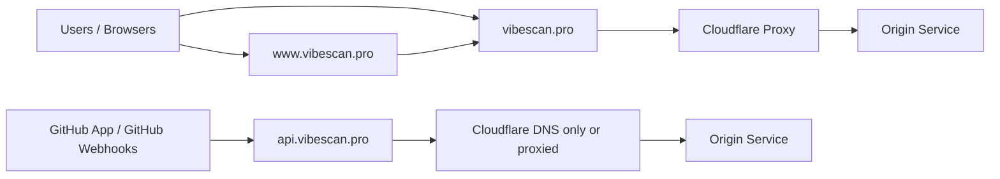
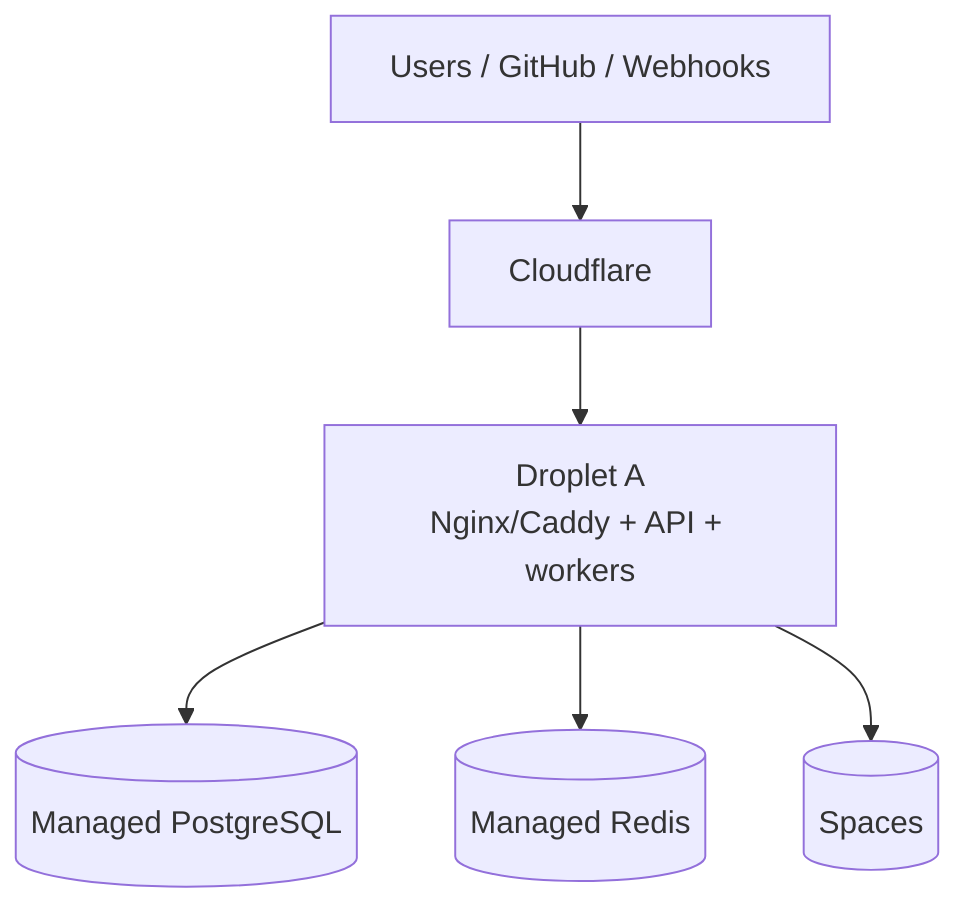
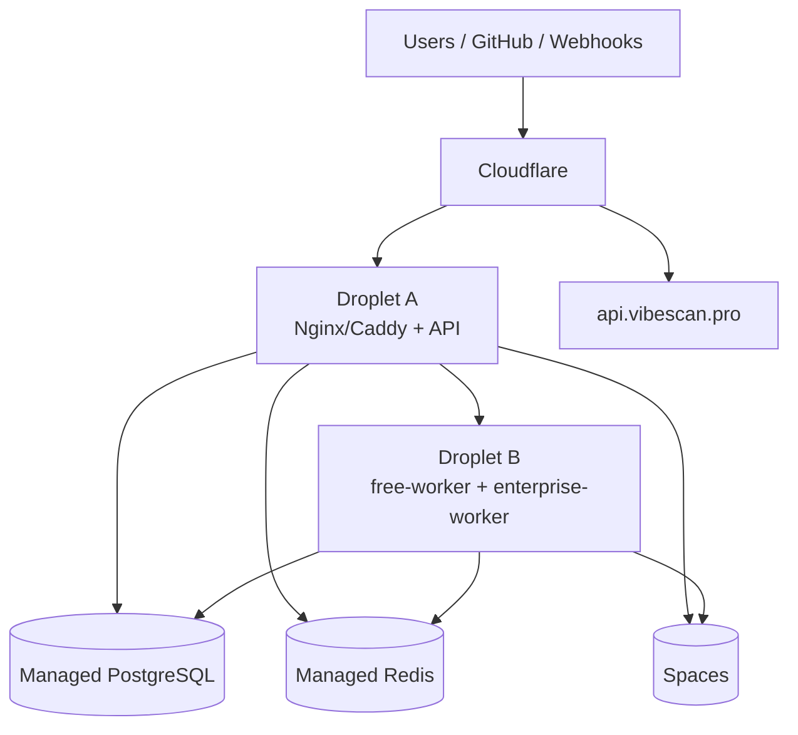
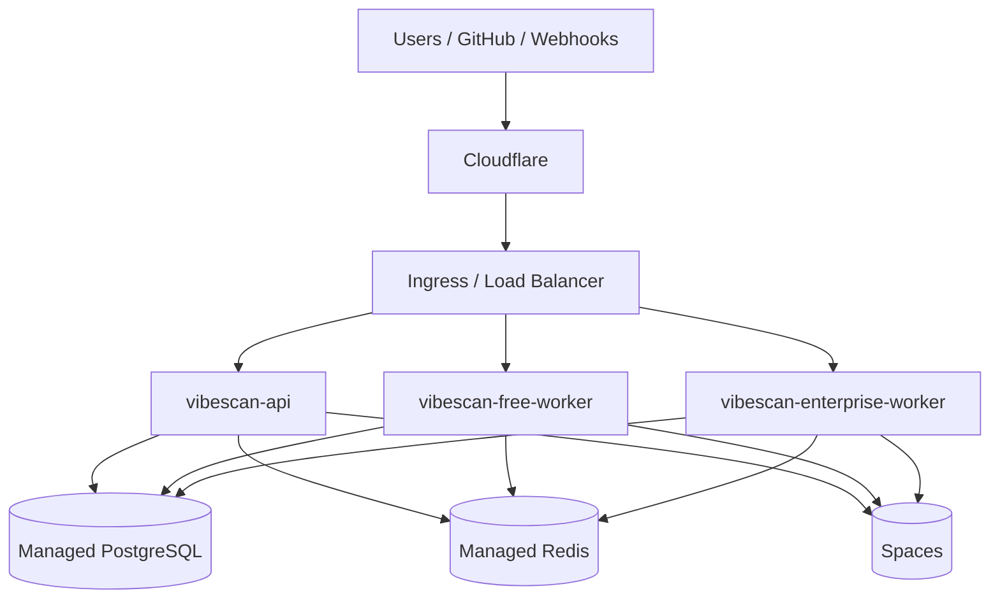

# VibeScan on DigitalOcean

This is the deployment plan for running VibeScan in production on DigitalOcean.
It is intentionally specific to the current repo shape:

- one Wasp app in `wasp-app/`
- one API container image from root `Dockerfile`
- one worker image from `Dockerfile.worker`
- one control plane, multiple execution workers
- PostgreSQL as source of truth
- Redis for BullMQ and runtime coordination

## Recommendation

Use DigitalOcean Kubernetes (DOKS) as the production target.

Why this is the right default:

- VibeScan has a split runtime: API plus at least two worker roles.
- The workers are long-lived and queue-driven, so they fit Kubernetes better than a single-process PaaS.
- Managed PostgreSQL and Managed Redis are better than running stateful services inside the app cluster.
- Spaces is a clean fit for scan artifacts, report exports, and S3-compatible storage needs.

Use App Platform only if you want a simpler launch with fewer moving parts and are willing to accept the tradeoff that worker/process topology is more constrained.

## DNS Plan

Recommended Cloudflare DNS layout for `vibescan.pro`:

- `vibescan.pro` -> public UI / app entry
- `www.vibescan.pro` -> redirect to `vibescan.pro`
- `api.vibescan.pro` -> API, GitHub webhook endpoint, and machine-facing calls

Cloudflare proxy guidance:

- keep `vibescan.pro` proxied
- keep `www.vibescan.pro` proxied and redirect it to the apex
- start `api.vibescan.pro` as `DNS only` while stabilizing the backend, then enable proxy only if you need it

### Cloudflare DNS Sketch



## Target Topology

### Public edge

- `vibescan.example.com`
- TLS terminated at the DigitalOcean load balancer or ingress
- optional `api.vibescan.example.com` if you want the API split from the web app
- GitHub App webhook endpoint reachable from the public internet

### Application layer

- `vibescan-api`
  - runs the built Wasp server
  - listens on port `3000` inside the container
  - sets `VIBESCAN_EMBED_WORKERS=false`
- `vibescan-free-worker`
  - consumes the free scan queue
  - runs `WORKER_ROLE=free`
- `vibescan-enterprise-worker`
  - consumes the enterprise scan queue
  - runs `WORKER_ROLE=enterprise`

### Managed services

- Managed PostgreSQL
  - source of truth for users, workspaces, scans, reports, findings, webhooks, and installation settings
- Managed Redis
  - BullMQ queues
  - rate limiting and coordination
  - transient job state
- Spaces
  - S3-compatible file storage
  - scan artifacts, exports, and future report attachments

### Optional supporting services

- DigitalOcean Container Registry for built images
- DigitalOcean Monitoring and alerting
- Managed backups for PostgreSQL

## What Not To Do

- Do not run PostgreSQL inside the app cluster in production if you can avoid it.
- Do not run Redis inside the app cluster in production if you can avoid it.
- Do not rely on local filesystem state for scanner outputs.
- Do not treat the dev contour in `./run.sh` as the production model.
- Do not let the API process silently become a worker in production.

## Phase 0: Preflight

Before provisioning infrastructure, make sure the repo is in a deployable state:

1. `npm run lint`
2. `npx tsc --noEmit`
3. `npm test`
4. `npm run openapi:contract`
5. `cd wasp-app && wasp build`

Also confirm:

- `wasp-app/.env.server.example` matches the runtime contract
- `docs/DEPLOYMENT.md` and `docs/ARCHITECTURE.md` describe the same runtime shape
- the GitHub App and webhook settings are understood for the target domain

## Phase 1: Provision DigitalOcean

Create the cloud foundation first.

### 1.1 Project and network

- Create a DigitalOcean project for VibeScan
- Choose the target region once and keep it stable
- Create a dedicated VPC for the app, database, and queue services
- Decide the public DNS zone early, because webhook and callback URLs depend on it

### 1.2 Container registry

- Create a DigitalOcean Container Registry
- Standardize image names and tags:
  - `vibescan-api:<git-sha>`
  - `vibescan-worker:<git-sha>`
- Keep image tags immutable for rollback

### 1.3 Managed database

- Provision a managed PostgreSQL cluster
- Use a production-sized plan, not a development-sized one
- Enable backups and maintenance windows
- Put it in the same region and VPC as the app
- Store the private connection string as a secret, not in source control

### 1.4 Managed Redis

- Provision a managed Redis cluster
- Use the same region and VPC as the app
- Restrict network access to the app cluster
- Keep Redis purely as a runtime dependency, not a data archive

### 1.5 Spaces

- Create a Spaces bucket for VibeScan artifacts
- Enable a CDN only if there is a clear use case
- Use Spaces as the S3-compatible target for artifact storage

## Phase 2: Define Runtime Config

Split configuration into four groups.

### 2.1 Core application config

- `PORT=3000`
- `DATABASE_URL`
- `REDIS_URL`
- `JWT_SECRET`
- `ENCRYPTION_KEY`

### 2.2 GitHub App config

- `GITHUB_APP_ID`
- `GITHUB_APP_SLUG`
- `GITHUB_APP_PRIVATE_KEY`
- `GITHUB_APP_WEBHOOK_SECRET`
- `GITHUB_APP_API_BASE_URL` if you need a non-default GitHub API host

### 2.3 Storage config

- `AWS_S3_REGION`
- `AWS_S3_IAM_ACCESS_KEY`
- `AWS_S3_IAM_SECRET_KEY`
- `AWS_S3_FILES_BUCKET`
- `AWS_S3_ENDPOINT`
- `AWS_S3_FORCE_PATH_STYLE=true`

If the app uses artifact capture features:

- `VIBESCAN_CYCLONEDX_ARTIFACT_BUCKET`
- `VIBESCAN_CYCLONEDX_ARTIFACT_CAPTURE_ENABLED`
- `VIBESCAN_CYCLONEDX_ARTIFACT_CLEANUP_ENABLED`

### 2.4 Scanner and integration config

- `VIBESCAN_ENABLE_SNYK_SCANNER`
- `VIBESCAN_SNYK_CREDENTIAL_MODE`
- `SNYK_TOKEN` if Snyk is enabled
- any scanner image overrides used by the runtime

### 2.5 Secrets handling rule

- Keep secrets in DigitalOcean secret environment variables or Kubernetes secrets
- Never commit production secrets into `.env.server`
- Never bake secrets into images

## Architecture Diagrams

### 1. Minimal and cheap



This is the cheapest way to get started, but it keeps the biggest failure domain in one machine.

### 2. Practical two-droplet setup



This is the best “simple migration upward” step if you want to separate serving from queue processing without introducing Kubernetes yet.

### 3. Production-safe target



This is the cleanest target for 10-20 parallel scans because API and workers can scale independently.

## Phase 3: Build and Release Images

Use the repo root Dockerfiles as the canonical build inputs.

### 3.1 API image

- Build from root `Dockerfile`
- The image should run the built Wasp server
- The container must remain stateless

### 3.2 Worker image

- Build from `Dockerfile.worker`
- The worker image must start `wasp-app/src/server/workers/runQueueWorker.ts`
- `WORKER_ROLE` determines which queue consumer starts

### 3.3 Release tagging

Use a simple immutable tag strategy:

- `sha-<short-sha>`
- optionally a semantic release tag for operator convenience

### 3.4 Build pipeline

Preferred flow:

1. GitHub Actions builds both images
2. GitHub Actions pushes them to DigitalOcean Container Registry
3. Deployment updates only the image tag, not the manifest shape

This keeps deploys deterministic and makes rollback trivial.

## Phase 4: Kubernetes Layout

Use the existing `deploy/kubernetes/` structure as the starting point, but treat the production overlay as DO-specific.

### 4.1 Namespace

- Create a dedicated namespace for VibeScan
- Keep app, workers, secrets, and config in that namespace

### 4.2 Secrets

- Store database, Redis, GitHub App, S3, Stripe, and scanner secrets in Kubernetes secrets
- Create separate secrets for runtime secrets and build-time-only values if you ever need them

### 4.3 ConfigMap

- Put non-secret runtime config in a ConfigMap
- Include URLs, feature flags, and log-level defaults

### 4.4 Deployments

Create three primary deployments:

- `vibescan-api`
- `vibescan-free-worker`
- `vibescan-enterprise-worker`

Each deployment should have:

- explicit resource requests and limits
- rolling update strategy
- liveness/readiness probes
- log output to stdout and stderr only

### 4.5 Services and ingress

- Expose the API through a ClusterIP service
- Put ingress in front of the API service
- Route all public traffic through ingress
- Keep worker services internal only

### 4.6 Persistent volume for scanner cache

If you want faster OWASP Dependency-Check runs:

- add a PVC for the worker cache
- mount it at `OWASP_DATA_DIRECTORY`

If you want the simplest first production cut:

- skip the cache PVC
- accept colder first-run scans

## Phase 5: Data Wiring

### 5.1 PostgreSQL cutover

- Point `DATABASE_URL` to the managed PostgreSQL cluster
- Run migrations before opening production traffic
- Verify the schema is current
- Make sure the app boots cleanly against the production database

### 5.2 Redis cutover

- Point `REDIS_URL` to the managed Redis cluster
- Confirm BullMQ jobs enqueue and drain correctly
- Verify scan status updates continue to flow through the queue

### 5.3 Spaces wiring

- Point the S3 env vars at the Spaces endpoint
- Confirm upload, download, and cleanup work
- Check that artifact URLs remain stable enough for user-facing links

## Phase 6: Deployment Order

Deploy in this order:

1. Database and Redis
2. Secrets and config
3. API deployment
4. Free worker deployment
5. Enterprise worker deployment
6. Ingress and DNS

Do not invert steps 3-5. The workers should not go live before the API can submit and reconcile jobs.

## Phase 7: Smoke Test

After the first production rollout, validate the following:

1. `/health` responds on the public endpoint
2. login and signup work
3. API key generation works
4. scan submission works
5. queue workers pick up jobs
6. scan details page updates from queued to completed
7. GitHub webhook delivery succeeds
8. GitHub check runs are created and updated
9. report pages load findings and CI decision correctly
10. artifact storage works for any scan or report output that uses Spaces

## Phase 8: GitHub Integration

VibeScan has two GitHub-facing deployment surfaces.

### 8.1 GitHub App path

- GitHub sends webhook events to the public webhook endpoint
- VibeScan enqueues the scan
- the GitHub check run goes through queued / in_progress / completed
- the report page becomes the triage destination

### 8.2 Reusable Actions gate

- consumer repos call the reusable workflow
- the workflow submits a scan via API key
- it waits for completion
- it reads the CI decision
- it fails the job if the decision is blocking

### 8.3 Production requirements

- webhook URL must match the deployed public domain exactly
- GitHub App private key and webhook secret must match the app settings
- installation records must point to the deployed workspace and repo settings

## Phase 9: Observability

### Logs

- Stream API and worker logs to DigitalOcean logging or your external log sink
- Redact secrets and tokens
- Include request IDs where possible

### Metrics

- monitor request latency
- monitor queue depth
- monitor job failure rate
- monitor scan duration by provider

### Alerts

Create alerts for:

- API health check failures
- worker crash loops
- PostgreSQL connection failures
- Redis unavailability
- queue backlog growth
- webhook delivery failures

## Phase 10: Backup and Recovery

### PostgreSQL

- enable automated backups
- test restore at least once
- define RPO and RTO

### Redis

- treat Redis as disposable runtime state
- do not rely on Redis persistence as your only source of truth

### Spaces

- define retention for large artifacts
- confirm lifecycle cleanup if report outputs are temporary

## Phase 11: Update Strategy

Treat application updates and schema updates as one release unit.

For DOKS, the recommended operational path is the dedicated
`npm run deploy:digitalocean:migrate` wrapper, which bootstraps/reconciles the
cluster and then runs the full update flow. Keep that path as the default for
future app and schema rollouts after the droplet-to-DOKS cutover.

### 11.1 Safe default: expand and contract

For most releases, use the expand/contract pattern:

1. deploy additive database changes first
2. keep the old code path working
3. deploy the new API and workers
4. switch reads/writes to the new shape
5. remove old columns/tables in a later release

This keeps rollback simple because old code can still understand the schema.

### 11.2 Non-breaking schema changes

Examples:

- new nullable column
- new table
- new index
- backfilled status field

Recommended order:

1. create the migration
2. apply the migration to production
3. deploy API and worker images that know about the new schema
4. verify reads/writes and background jobs

### 11.3 Breaking schema changes

Examples:

- column rename
- type change
- table split
- removing fields old code still reads

Recommended order:

1. add the new structure alongside the old one
2. dual-write or backfill if needed
3. ship code that reads the new structure but still tolerates the old one
4. cut traffic over
5. remove the old structure in a later release

Do not do an irreversible schema change in the same deploy that first depends on it.

### 11.4 Deployment order

Use this order unless the migration itself demands a special sequence:

1. build and tag new images
2. take a database backup or snapshot
3. apply migration(s)
4. deploy API
5. deploy free worker
6. deploy enterprise worker
7. run smoke tests

### 11.5 Rollback rule

Rollback is safe only if the database is still backward-compatible with the previous image.

If the migration is backward-compatible:

- roll back the image tag
- keep the database as-is
- re-run smoke tests

If the migration is not backward-compatible:

- prefer fixing forward with a new migration
- only restore from backup if the release is irrecoverable

## Phase 12: Rollback Plan

Rollback should be image-tag based.

1. keep the previous image tag available
2. update the deployment to the previous tag
3. wait for rollout completion
4. verify health and queue processing
5. inspect logs if the failure was data-related

If the issue is database migration related, rollback the application image first and avoid destructive schema backouts unless you have a tested migration reversal path.

## Phase 13: Cutover Checklist

Use this checklist before declaring the DigitalOcean deployment live:

- [ ] `npm run lint` passed
- [ ] `npx tsc --noEmit` passed
- [ ] `npm test` passed
- [ ] `npm run openapi:contract` passed
- [ ] `cd wasp-app && wasp build` passed
- [ ] managed PostgreSQL created and reachable
- [ ] managed Redis created and reachable
- [ ] Spaces bucket created and writable
- [ ] API image built and pushed
- [ ] worker image built and pushed
- [ ] API deployment healthy
- [ ] free worker deployment healthy
- [ ] enterprise worker deployment healthy
- [ ] migrations applied to production database
- [ ] webhook endpoint reachable from GitHub
- [ ] GitHub App settings updated to production domain
- [ ] smoke test completed successfully

## DOKS Command Runbook

This is the executable version of the plan above.

If you want the bootstrapper as a single entrypoint, use:

```bash
npm run deploy:digitalocean:menu
npm run deploy:digitalocean:bootstrap -- \
  --region nyc1 \
  --spaces-region nyc3 \
  --project-name vibescan-production \
  --cluster-name vibescan-production \
  --postgres-name vibescan-production-pg \
  --redis-name vibescan-production-redis
```

Without flags the script opens an interactive menu. Use `--bootstrap`, `--deploy`,
`--full`, `--status`, `--droplet-single`, or `--droplet-dual` when you want a
direct non-interactive action.

For the shortest command map, see `deployment-scripts/INDEX.md`.

The bootstrapper writes `.vibescan/digitalocean-state.json` after every run so
repeat deployments reuse the saved project, registry, database, Redis, and
droplet/cluster metadata without any manual input.

For a droplet-to-DOKS transition or later DOKS updates, use the separate
headless migration wrapper:

```bash
npm run deploy:digitalocean:migrate
```

Implementation details and operator notes live in `deployment-scripts/README.md`
and `deployment-scripts/AGENTS.md`.

The script requires:

- `doctl` authenticated with your DigitalOcean account
- `kubectl`
- `curl`
- `DO_TOKEN`, `PAT`, or `DIGITALOCEAN_TOKEN` in `.env` for the Spaces access-key API call
- optionally `aws` if you want the script to create the Spaces bucket too

Example `.env`:

```env
PAT=do_pat_xxxxx
```

Bootstrap menu options:

- bootstrap infrastructure
- bootstrap single droplet stack
- bootstrap two-droplet stack
- sync runtime config and secrets
- build and push images
- roll out images
- run migrations
- smoke test
- show status
- run the full deploy
- print architecture variants
- DOKS update / rollout only
- migrate droplets to DOKS

The DOKS migration wrapper is intentionally non-interactive. It reads the saved
deployment state and runs the update flow headlessly, which is the path to use
for repeat updates after the initial DNS cutover.
It also inspects `wasp-app/migrations/` against the production database and
automatically decides whether a database migration step is required.
At the end of each run it prints a short post-deploy checklist tailored to the
saved deployment mode.

### 0. Local prerequisites

Install and authenticate the tooling first:

```bash
doctl auth init
doctl auth list
kubectl version --client
docker version
```

Set the deployment variables:

```bash
export DO_REGION=nyc1
export DO_PROJECT_NAME=vibescan-production
export DO_VPC_NAME=vibescan-production-vpc
export DO_REGISTRY_NAME=vibescan
export DO_CLUSTER_NAME=vibescan-production
export DO_POSTGRES_NAME=vibescan-production-pg
export DO_REDIS_NAME=vibescan-production-redis
export DO_NAMESPACE=vibescan
export DO_DOMAIN=vibescan.example.com
export DO_GITHUB_WEBHOOK_DOMAIN=api.vibescan.example.com
```

### 1. Create the DigitalOcean project and network

```bash
doctl projects create \
  --name "$DO_PROJECT_NAME" \
  --purpose "Web Application" \
  --environment Production \
  --description "VibeScan production environment"

doctl vpcs create \
  --name "$DO_VPC_NAME" \
  --region "$DO_REGION"
```

Capture the returned VPC UUID and reuse it below.

### 2. Create the container registry

```bash
doctl registry create "$DO_REGISTRY_NAME" --region "$DO_REGION"
doctl registry login
```

If you want Kubernetes to pull from the registry, apply the registry secret manifest:

```bash
doctl registry kubernetes-manifest "$DO_REGISTRY_NAME" --namespace="$DO_NAMESPACE" | kubectl apply -f -
```

### 3. Create the Kubernetes cluster

Choose a Kubernetes version from:

```bash
doctl kubernetes options versions
```

Then create the cluster:

```bash
doctl kubernetes cluster create "$DO_CLUSTER_NAME" \
  --region "$DO_REGION" \
  --version "<kubernetes-version>" \
  --vpc-uuid "<vpc-uuid>" \
  --node-pool "name=apps;size=s-2vcpu-4gb;count=3"
```

If the kubeconfig is not already active, save it explicitly:

```bash
doctl kubernetes cluster kubeconfig save "$DO_CLUSTER_NAME"
```

### 4. Create managed PostgreSQL and Redis

```bash
doctl databases create "$DO_POSTGRES_NAME" \
  --engine pg \
  --region "$DO_REGION" \
  --size db-s-2vcpu-4gb \
  --num-nodes 1 \
  --private-network-uuid "<vpc-uuid>" \
  --wait

doctl databases create "$DO_REDIS_NAME" \
  --engine redis \
  --region "$DO_REGION" \
  --size db-s-1vcpu-1gb \
  --num-nodes 1 \
  --private-network-uuid "<vpc-uuid>" \
  --wait
```

Then fetch private connection strings:

```bash
doctl databases list
doctl databases connection "<postgres-cluster-id>" --private --format URI --no-header
doctl databases connection "<redis-cluster-id>" --private --format URI --no-header
```

### 5. Create the Spaces key

Create the bucket in the DigitalOcean control panel, then create a key for it:

```bash
doctl spaces keys create vibescan-production \
  --grants "bucket=vibescan-artifacts;permission=readwrite"
```

Use the resulting access key and secret in the Kubernetes secrets below.

### 6. Build and push the images

```bash
export GIT_SHA="$(git rev-parse --short HEAD)"
export DO_REGISTRY_IMAGE="registry.digitalocean.com/$DO_REGISTRY_NAME"

docker build -t "$DO_REGISTRY_IMAGE/vibescan-api:$GIT_SHA" -f Dockerfile .
docker build -t "$DO_REGISTRY_IMAGE/vibescan-worker:$GIT_SHA" -f Dockerfile.worker .

docker push "$DO_REGISTRY_IMAGE/vibescan-api:$GIT_SHA"
docker push "$DO_REGISTRY_IMAGE/vibescan-worker:$GIT_SHA"
```

### 7. Prepare the namespace and base manifests

```bash
kubectl apply -f deploy/kubernetes/namespace.yaml
```

For production, prefer rendered config and secrets over the placeholder manifests in the repo.
The committed `configmap.yaml` and `secret.yaml` are reference material, not production values.

Create the production config map:

```bash
kubectl create configmap vibescan-config \
  -n "$DO_NAMESPACE" \
  --from-literal=NODE_ENV=production \
  --from-literal=PORT=3000 \
  --from-literal=LOG_LEVEL=info \
  --from-literal=REDIS_URL="redis://<redis-host>:6379" \
  --from-literal=AWS_REGION="$DO_REGION" \
  --from-literal=S3_BUCKET_SOURCES=vibescan-sources \
  --from-literal=S3_BUCKET_SBOMS=vibescan-sboms \
  --from-literal=S3_BUCKET_PDFS=vibescan-pdfs \
  --from-literal=JWT_ACCESS_EXPIRY=15m \
  --from-literal=JWT_REFRESH_EXPIRY=30d \
  --from-literal=MAX_SOURCE_SIZE_MB=50 \
  --from-literal=CVE_UPDATE_INTERVAL_HOURS=6 \
  --from-literal=RATE_LIMIT_WINDOW_MS=60000 \
  --from-literal=RATE_LIMIT_MAX_REQUESTS=100 \
  --dry-run=client -o yaml | kubectl apply -f -
```

Create the production secret:

```bash
kubectl create secret generic vibescan-secrets \
  -n "$DO_NAMESPACE" \
  --from-literal=DB_PASSWORD="<postgres-password>" \
  --from-literal=AWS_ACCESS_KEY_ID="<spaces-access-key>" \
  --from-literal=AWS_SECRET_ACCESS_KEY="<spaces-secret-key>" \
  --from-literal=ENCRYPTION_KEY="<64-char-hex-key>" \
  --from-literal=JWT_SECRET="<strong-jwt-secret>" \
  --from-literal=STRIPE_SECRET_KEY="<stripe-secret>" \
  --from-literal=STRIPE_WEBHOOK_SECRET="<stripe-webhook-secret>" \
  --from-literal=GITHUB_APP_ID="<github-app-id>" \
  --from-literal=GITHUB_APP_SLUG="<github-app-slug>" \
  --from-literal=GITHUB_APP_PRIVATE_KEY="<github-app-private-key-pem>" \
  --from-literal=GITHUB_APP_WEBHOOK_SECRET="<github-app-webhook-secret>" \
  --from-literal=AWS_S3_ENDPOINT="https://<region>.digitaloceanspaces.com" \
  --from-literal=AWS_S3_FORCE_PATH_STYLE=true \
  --from-literal=AWS_S3_REGION="$DO_REGION" \
  --from-literal=AWS_S3_FILES_BUCKET="vibescan-artifacts" \
  --dry-run=client -o yaml | kubectl apply -f -
```

If you need Snyk or other scanner credentials, add them to the same secret or create a dedicated scanner secret.

### 8. Apply the workload manifests

```bash
kubectl apply -f deploy/kubernetes/api-deployment.yaml
kubectl apply -f deploy/kubernetes/free-worker-deployment.yaml
kubectl apply -f deploy/kubernetes/enterprise-worker-deployment.yaml
kubectl apply -f deploy/kubernetes/network-policy.yaml
```

Then point the running deployments at the registry images you pushed:

```bash
kubectl set image deployment/vibescan-api \
  api="$DO_REGISTRY_IMAGE/vibescan-api:$GIT_SHA" \
  -n "$DO_NAMESPACE"

kubectl set image deployment/vibescan-free-worker \
  worker="$DO_REGISTRY_IMAGE/vibescan-worker:$GIT_SHA" \
  -n "$DO_NAMESPACE"

kubectl set image deployment/vibescan-enterprise-worker \
  worker="$DO_REGISTRY_IMAGE/vibescan-worker:$GIT_SHA" \
  -n "$DO_NAMESPACE"
```

Important:

- the current `deploy/kubernetes/free-worker-deployment.yaml` includes a `hostPath` mount for `/var/run/docker.sock`
- do not carry that mount into production unless you have a very specific reason
- keep the worker pods as plain queue consumers

### 9. Apply ingress

Create or apply an ingress manifest that routes `"$DO_DOMAIN"` to the `vibescan-api` service on port 3000.
If you use a separate webhook hostname, route `"$DO_GITHUB_WEBHOOK_DOMAIN"` to the same service.

Example:

```yaml
apiVersion: networking.k8s.io/v1
kind: Ingress
metadata:
  name: vibescan-ingress
  namespace: vibescan
spec:
  rules:
    - host: vibescan.example.com
      http:
        paths:
          - path: /
            pathType: Prefix
            backend:
              service:
                name: vibescan-api
                port:
                  number: 3000
```

Apply it with your rendered ingress manifest:

```bash
kubectl apply -f deploy/kubernetes/ingress.yaml
```

### 10. Run migrations

Run the production database migration after the API is reachable but before opening the app to real traffic:

```bash
cd wasp-app && \
  DATABASE_URL="postgresql://<user>:<password>@<private-host>:25060/vibescan?sslmode=require" \
  wasp db migrate-dev --name "production-digitalocean"
```

If your production workflow prefers non-interactive apply, make sure the migration is already present in the repo and run the equivalent Wasp migration command against the production database URL.

### 11. Smoke test

```bash
curl -f "https://$DO_DOMAIN/health"
curl -f "https://$DO_DOMAIN/login"
```

Then verify the application flow:

1. sign up or log in
2. generate an API key
3. submit a scan
4. confirm the free worker consumes the job
5. confirm the report page populates
6. send a test GitHub webhook
7. verify the check run appears in GitHub

If you need a quick live check of the rollout state:

```bash
kubectl get pods -n "$DO_NAMESPACE"
kubectl get deploy -n "$DO_NAMESPACE"
kubectl logs -n "$DO_NAMESPACE" deployment/vibescan-api --tail=100
kubectl logs -n "$DO_NAMESPACE" deployment/vibescan-free-worker --tail=100
kubectl logs -n "$DO_NAMESPACE" deployment/vibescan-enterprise-worker --tail=100
```

### 13. Rollback

Rollback is image-tag based:

```bash
kubectl set image deployment/vibescan-api api="$DO_REGISTRY_IMAGE/vibescan-api:<previous-sha>" -n "$DO_NAMESPACE"
kubectl set image deployment/vibescan-free-worker worker="$DO_REGISTRY_IMAGE/vibescan-worker:<previous-sha>" -n "$DO_NAMESPACE"
kubectl set image deployment/vibescan-enterprise-worker worker="$DO_REGISTRY_IMAGE/vibescan-worker:<previous-sha>" -n "$DO_NAMESPACE"
```

Then re-run the smoke test and inspect logs before proceeding.

## Simplified App Platform Variant

If you want a smaller first step than DOKS, you can still use DigitalOcean App Platform.

Use it only if:

- you are comfortable with the App Platform component model
- you want fewer infrastructure objects to manage
- you can live with a less explicit worker deployment story

In that mode:

- deploy the API as a service
- deploy workers as worker components
- use managed PostgreSQL and Redis
- use Spaces for storage
- keep the same environment contract and cutover checklist

The key rule does not change:

- the app stays split into API and workers
- data stays in managed services
- execution stays stateless apart from approved caches
